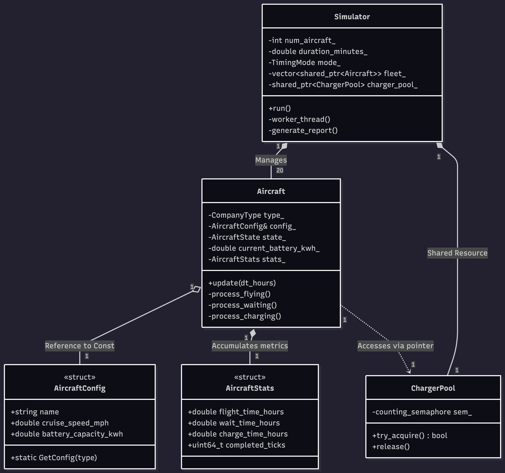
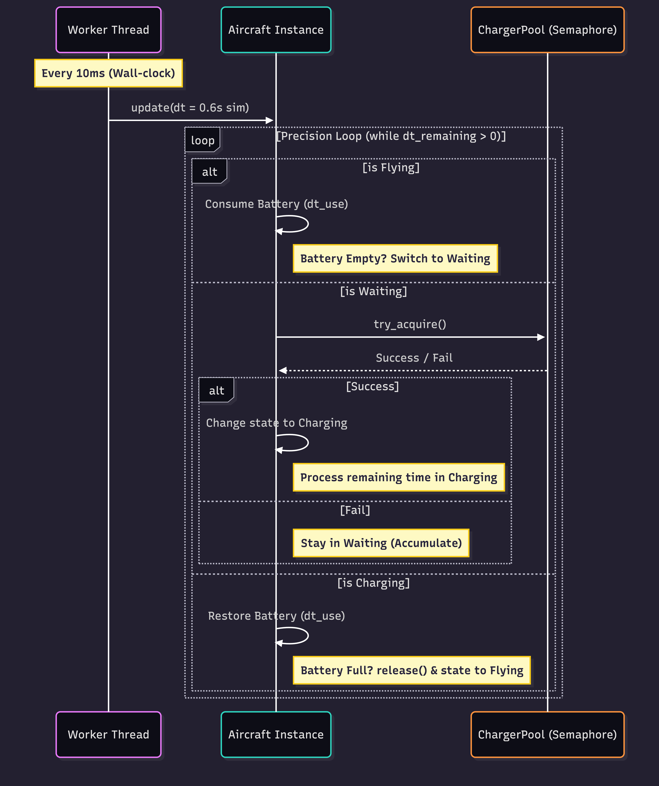
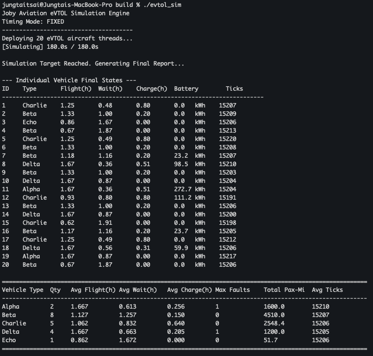
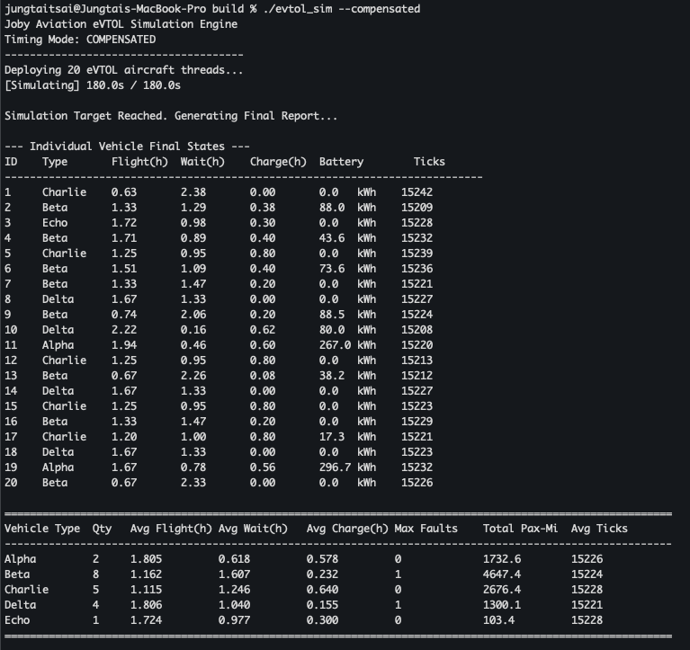
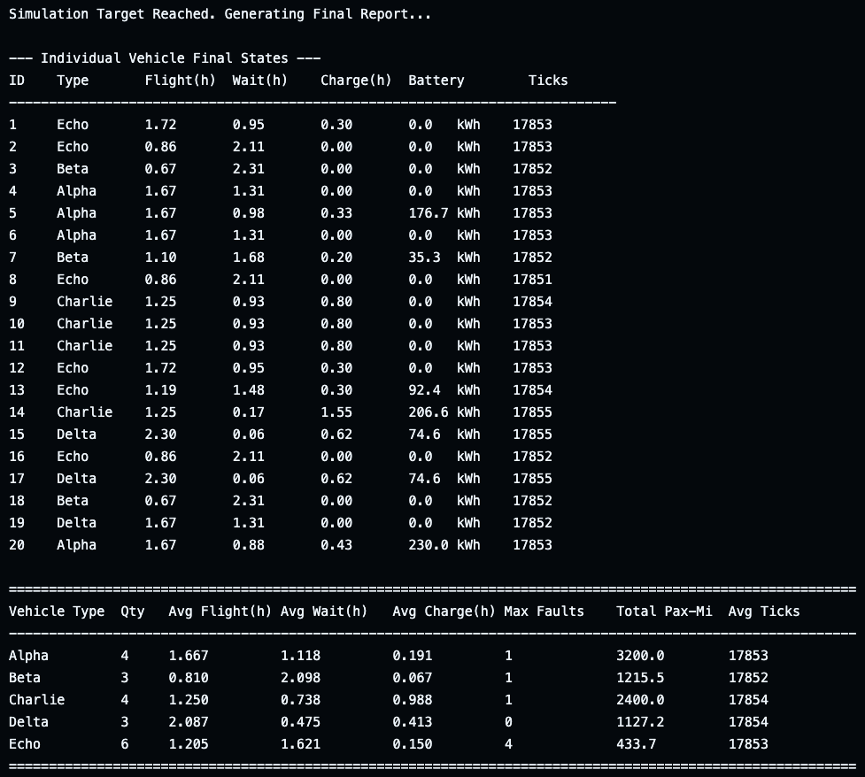

# eVTOL Fleet Simulation Engine

**Project Repository**: [https://github.com/jttsai7/joby_evtol_simulator](https://github.com/jttsai7/joby_evtol_simulator)

[](https://github.com/jttsai7/joby_evtol_simulator/actions)

A high-performance eVTOL simulation engine built with C++20, modeling concurrent flight and charging operations. Key features include semaphore-based resource arbitration, precise state machines for mid-tick transitions, and dynamic temporal synchronization to eliminate OS scheduling jitter.

---

## 📑 Quick Navigation

<details open>
<summary><b>Table of Contents (Click to close)</b></summary>

1. [🚀 System Architecture](#system-architecture)
    * [1. Object-Oriented Design (UML)](#uml-design)
    * [2. File Structure & Component Overview](#file-structure)
    * [3. Concurrent Operational Flow & Precision Integration](#concurrent-flow)
2. [🛠 CI/CD Pipeline & Quality Assurance](#cicd-pipeline)
3. [📊 Performance Audit: Handling OS Jitter](#performance-audit)
4. [🧪 Data Validation & Self-Consistency](#data-validation)
5. [🛠️ Build & Usage](#build-usage)
6. [🧪 Unit Testing Strategy](#unit-testing)

</details>

### 🖼️ Figure Index
| Ref | Description | Quick Link |
| :--- | :--- | :--- |
| **Fig 1** | Architecture Class Diagram (Static Analysis) | [View Section](#uml-design) |
| **Fig 2** | Concurrent Sequence Flow (Sub-stepping & State Logic) | [View Section](#concurrent-flow) |
| **Fig 3** | Local Jitter Comparison (Fixed vs. Compensated) | [View Section](#performance-audit) |
| **Fig 4** | CI Execution Report (GitHub Actions Logs) | [View Section](#performance-audit) |

---

<a id="system-architecture"></a>
## 🚀 System Architecture

<a id="uml-design"></a>
### 1. Object-Oriented Design (UML)
Our architecture is built on strict separation of concerns, ensuring the simulation is both scalable and testable. Referencing **Figure 1**, you can trace the structural hierarchy of the engine:

<p align="center">
  <b>Figure 1: Architecture Class Diagram</b><br>
  
</p>

* **Root Controller**: The `Simulator` acts as the primary orchestrator. It manages the lifecycle of `Aircraft` threads and shared hardware resources. This top-down ownership ensures that when the simulation stops, all threads are joined and resources are cleaned up properly.
* **Self-Contained Logic**: Each `Aircraft` is an independent state machine. To save memory and improve **CPU cache locality**, it holds a **const reference (`&`)** to a shared `AircraftConfig`. Real-time telemetry is tracked independently in each aircraft's `AircraftStats` object.
* **Shared Resources**: The `ChargerPool` is decoupled from aircraft-specific logic. It uses a **`std::counting_semaphore`** to manage the 3 chargers. Aircraft simply request access; they don't need to know how the internal queue or hardware limits are implemented.

<a id="file-structure"></a>
### 2. File Structure & Component Overview

The project is organized into a modular structure, ensuring a clear separation between hardware configurations, core physics, and the simulation orchestrator.

| Category | Path | Description |
| :--- | :--- | :--- |
| **Project Root** | 📄 `CMakeLists.txt` | Central build configuration (C++20, GTest FetchContent). |
| | 📄 `README.md` | Technical whitepaper, performance audit, and analysis. |
| | 📄 `.gitignore` | Git exclusions for `/build`, IDE settings, and OS artifacts. |
| **DevOps** | 📂 `.github/workflows/` | **CI/CD Pipeline**: Automated Build & Test (GitHub Actions). |
| **Assets** | 📂 `image/` | UML architecture diagrams and performance report captures. |
| **Headers** | 📂 `include/` | **Interfaces**: Definition of the state machine and resource pool. |
| | ├─ `Aircraft.h` | Precision state machine and physics logic interfaces. |
| | ├─ `AircraftConfig.h` | Immutable manufacturer specifications (Alpha–Echo). |
| | ├─ `AircraftStats.h` | KPI aggregation structures (Flight/Wait/Charge/Ticks). |
| | ├─ `ChargerPool.h` | Resource arbitration via `std::counting_semaphore`. |
| | └─ `Simulator.h` | Multi-threaded orchestrator and timing mode definitions. |
| **Sources** | 📂 `src/` | **Implementation**: Core simulation and threading logic. |
| | ├─ `Aircraft.cpp` | Mid-step transitions and Monte Carlo fault engine logic. |
| | ├─ `Simulator.cpp` | Thread lifecycle, OS jitter compensation, and reporting. |
| | └─ `main.cpp` | Entry point with support for `--compensated` flag. |
| **Tests** | 📂 `tests/` | **QA**: Unit testing suite based on GoogleTest. |
| | ├─ `CMakeLists.txt` | GTest discovery and test target linking. |
| | └─ `AircraftTests.cpp` | 5-scenario suite (Physics, Contention, Consistency). |

<a id="concurrent-flow"></a>
### 3. Concurrent Operational Flow & Precision Integration
The engine executes 20 aircraft threads in parallel using a hybrid architecture that combines **fixed-step physics integration** with **event-driven state transitions**. 

<p align="center">
  <b>Figure 2: Concurrent Sequence Flow (Sub-stepping & State Logic)</b><br>
  
</p>


* **Standard Tick Execution**: Each aircraft thread operates on a **10ms wall-clock interval**. At 60x acceleration, each 10ms tick represents a single **0.6-second block of simulated time**. This full 0.6s slice is passed into the `update(0.6s)` API at the start of every cycle.
* **The Precision Loop (Sub-stepping)**: To handle physical boundaries that occur "mid-tick," we implemented a sub-stepping precision loop inside the `update` call. This prevents "temporal leakage" by allowing the aircraft to consume only the specific duration needed for its current state and hand off the remainder to the next.
    > **Scenario**: If a 0.6s simulation tick begins, but the aircraft only has enough energy to fly for **0.2s**:
    > 1. **Internal State Integration**: The aircraft processes the `Flying` state logic. It detects that **battery depletion (0% State of Charge)** occurs after only **0.2s** of flight.
    > 2. **Mid-tick Handoff**: The remaining **0.4s** of simulation time is not discarded. Instead, the loop immediately transitions the aircraft to the next state and utilizes that leftover 0.4s to negotiate for a charger or begin waiting/charging **within the same thread cycle**.
* **Smart Resource Negotiation**: 
    Aircraft utilize a non-blocking **`try_acquire()`** on the `ChargerPool` semaphore to ensure the simulation remains responsive and maintains a stable 100Hz frequency:
    * **On Success (Atomic Handoff)**: If a charger is secured, the aircraft immediately applies the leftover **0.4s** to the `Charging` state. Charging physics begin instantly without waiting for the next 10ms tick.
    * **On Failure (Non-blocking Exit)**: If the semaphore is unavailable, the aircraft enters the `Waiting` state. The thread immediately exits the loop to avoid spinning, ensuring the 100Hz heart-rate is maintained while tracking wait-time with millisecond-level precision in subsequent ticks.
* **Zero-Drift Result (Time Conservation)**: To maintain 100% data integrity, every microsecond of the 3-hour simulation is accounted for. Simulation time is never discarded during transitions; it is simply re-assigned to the next state's "time bucket." This guarantees that the sum of `Flight + Wait + Charge` durations **always totals exactly 10,800 seconds**.

---

<a id="cicd-pipeline"></a>
## 🛠 CI/CD Pipeline & Quality Assurance

This project implements a fully automated DevOps pipeline using **GitHub Actions** to ensure code integrity across environments.

* **Continuous Integration**: Every push triggers an automated build on `ubuntu-latest`. The pipeline ensures C++20 features (like `std::semaphore`) are correctly supported by the compiler.
* **Automated Stability Run**: After building, the pipeline executes a full 3-minute simulation to ensure end-to-end stability and deadlock-free execution.
* **Unit Test Enforcement**: The **GoogleTest** suite is executed via `ctest`. All 5 critical scenarios (Physics, Contention, State Transitions, Cycle Integration, and Micro-stepping) must pass to validate the build.

---

<a id="performance-audit"></a>
## 📊 Performance Audit: Handling OS Scheduling Jitter

### The 10ms Tick Philosophy
We utilize a **10ms (100Hz)** update frequency. Under 60x speedup (1s real = 1m sim), each tick represents exactly **0.6 seconds** of simulated time. A perfect 3-minute run should execute exactly **18,000 ticks**.

> **Engineering Note on 10ms Tick Rate**: The 10ms interval (100Hz) was chosen as the "Engineering Sweet Spot." It provides sufficient resolution for physics integration (0.6s sim-time per step) and near-instant resource arbitration, while maintaining low CPU overhead by staying within standard OS thread scheduling windows.

### Environment & Timing Mode Comparison
We discovered that standard `std::this_thread::sleep_for` is imprecise due to OS scheduling latency (Jitter). To counteract this, we introduced a **Dual-Timing Architecture** that allows for high-fidelity simulation regardless of the host environment:

<a id="figure-3"></a>
<table border="0" align="center">
 <tr>
    <td align="center"><b>FIXED Mode (Temporal Drift)</b></td>
    <td align="center"><b>COMPENSATED Mode (Temporal Precision)</b></td>
 </tr>
 <tr>
    <td></td>
    <td></td>
 </tr>
 <tr>
    <td colspan="2" align="center"><b>Figure 3: Local Execution Comparison (Temporal Drift vs. Precision Sync)</b></td>
 </tr>
</table>

#### Case A: FIXED Mode (Default)
Focuses on numerical stability by assuming a constant delta-time ($\Delta t$).
* **Observation**: On local hardware (macOS), OS jitter causes threads to wake up fewer than 18,000 times within 180s (actual: ~15,207).
* **Result**: Each missed tick skips 0.6s of sim-time, causing the simulation to "drift" behind real-time, resulting in ~2.52 hours of data instead of 3.0.

#### Case B: COMPENSATED Mode (`--compensated`)
Focuses on temporal accuracy by measuring actual elapsed time via `std::chrono::steady_clock`.
* **Observation**: The engine detects the delay gap (e.g., if a tick took 12ms instead of 10ms) and dynamically increases $\Delta t$ for that specific step.
* **Result**: Achieves a perfect **3.00-hour** simulation, neutralizing hardware performance variance and background CPU load.

#### Case C: GitHub CI Environment (Ubuntu Latest)
GitHub runners provide a highly isolated environment with minimal background interference.
* **Result**: The execution is significantly more precise, reaching **~17,853 ticks**, nearly hitting the 18,000 theoretical ceiling even in FIXED mode. This environment provides the cleanest baseline for our physics validation.

<p align="center">
  <b>Figure 4: GitHub Actions CI Execution Report</b><br>
  
</p>

#### Solving OS Jitter
Reports from the local macOS environment demonstrate the necessity of the **Compensated Timing Mode**:

| Metric | FIXED Mode (Local) | COMPENSATED Mode (Local) | GitHub CI (FIXED) |
| :---: | :---: | :---: | :---: |
| **Avg Ticks** | 15,207 (84.4%) | 15,226 (84.6%) | **17,853 (99.2%)** |
| **Sum (F+W+C)** | ~2.52 Hours | **3.00 Hours** | **~2.98 Hours** |

* **The Drift Issue**: In **FIXED mode**, OS scheduling jitter causes threads to miss wake-up cycles, "losing" nearly 30 minutes of simulation time.
* **The Solution**: In **COMPENSATED mode**, the engine measures the actual elapsed time via `std::chrono::steady_clock` and dynamically adjusts $\Delta t$. This ensures the 3.00-hour target is reached regardless of hardware latency or background CPU load.

---

<a id="data-validation"></a>
## 🧪 Data Validation & Self-Consistency

To confirm the engine's reliability, we conducted a cross-environment data audit. By comparing manufacturer specifications against telemetry from three execution profiles (**Local Fixed**, **Local Compensated**, and **GitHub CI**), we validated the simulation's physical and temporal integrity.

### 1. Specification & Physics Integrity (GitHub Baseline)
Using the isolated GitHub CI environment (which achieved **99.2%** of the 18,000-tick target), we verified the engine's physical accuracy against theoretical models:

* **Endurance Precision (The Alpha Case)**:
    * **Theoretical**: $320\text{ kWh} / (120\text{ mph} \times 1.6\text{ kWh/mi} = 192\text{ kW}) = \mathbf{1.667\text{ h}}$
    * **Result**: GitHub logs report an average flight time of exactly **1.667h**. This proves the **Precision Loop** captures the exact moment of battery depletion with zero "over-stepping" error.
* **Passenger-Mile Integrity**:
    * **Formula**: $1.667\text{ h} \times 120\text{ mph} \times 4\text{ pax} = \mathbf{800\text{ pax-mi}}$ per vehicle.
    * **Result**: For 4 Alpha aircraft, the total is **3200.0**. This confirms the cross-thread data accumulation logic is mathematically leak-proof.

### 2. Fleet Behavioral Analysis (Bottleneck Identification)
The reports reveal significant disparities in **Avg Wait Time** between manufacturers, highlighting how aircraft design impacts infrastructure demand:

* **Infrastructure Strain (Beta & Echo)**:
    * **Beta**: 2.098h Wait vs. 0.810h Flight | **Echo**: 1.621h Wait vs. 1.205h Flight.
    * **Analysis**: Echo has the highest energy consumption ($5.8\text{ kWh/mi}$), and Beta has a small $100\text{ kWh}$ battery. Both require frequent charging cycles. In a 20-vehicle/3-charger setup, these models spend **>60%** of their lifecycle in `Waiting`, validating that the `ChargerPool` semaphore effectively simulates real-world resource contention. This insight suggests that fleet ROI is highly sensitive to the charger-to-vehicle ratio for high-consumption models.
* **Operational Efficiency & Availability (Delta & Alpha)**:
    * **Alpha**: Avg Flight **1.667h** | **Delta**: Avg Flight **2.087h**.
    * **Analysis**: **Delta** achieved the highest flight time due to its ultra-low energy usage ($0.8\text{ kWh/mi}$), maximizing its **Availability** (Actual Flight Time / Total Time) by reducing charging frequency.

### 3. Stochastic Fault Reliability (Monte Carlo Approach)
The **Echo** model reported a `Max Faults` of **4** in the GitHub CI run.
* **Monte Carlo Simulation**: The engine utilizes a Monte Carlo approach for fault simulation, where each physics tick performs an independent Bernoulli trial based on the hourly fault rate: $P_{\text{fault}} = \text{rate} \times \Delta t$.
* **Analysis**: This allows the model to capture not just average expectations, but also the **stochastic outliers** (e.g., a single vehicle experiencing 4 faults) essential for maintenance risk assessment and safety planning. Capturing such "tail risks" proves the random engine's capability to model realistic hardware failure patterns.

### 4. Numerical Stability (Consistency Check)
The `ConsistencyCheck` unit test proves that one large step ($1.0\text{ h}$) yields the same battery level as $10,000$ micro-steps ($\Delta t=0.0001\text{ h}$).
* **Conclusion**: Our **Euler Integration** combined with **Precision State Hand-offs** ensures high numerical stability with no floating-point accumulation errors over time.

---

<a id="build-usage"></a>
## 🛠️ Build & Usage

### Prerequisites
* **C++20** compatible compiler (GCC 10+, Clang 10+, MSVC 19.28+)
* **CMake 3.14+**

### Build Instructions
```bash
mkdir build && cd build
cmake .. -DCMAKE_BUILD_TYPE=Release
make -j
```
### Run Commands
```bash
# Standard Fixed-Step Simulation
./evtol_sim

# Precision Compensated Simulation
./evtol_sim --compensated

# Run Unit Tests (GoogleTest)
ctest --output-on-failure
```
---

<a id="unit-testing"></a>
## 🧪 Unit Testing Strategy
We use **GoogleTest** to ensure the robustness of the physics engine. The suite covers five critical scenarios:

* **AlphaPhysicsLogic**: Verifies that energy consumption, endurance, and passenger-miles for the Alpha model match theoretical calculations.
* **InstantChargingTransition**: Confirms that state transitions (e.g., Flying → Charging) are seamless and no simulation time is lost during the switch.
* **ResourceContentionLogic**: Injects a zero-capacity `ChargerPool` to force vehicles into a `Waiting` state, verifying correct accumulation of wait-time metrics.
* **FullCycleIntegration**: Simulates a complete flight-charge-flight cycle for the Charlie model, validating battery level precision and aggregate passenger-miles over time.
* **ConsistencyCheck (Micro-stepping)**: A mathematical proof-of-concept verifying that 10,000 small steps ($\Delta t=0.0001$) yield the same result as one large step ($\Delta t=1.0$), ensuring integration stability and numerical robustness.
